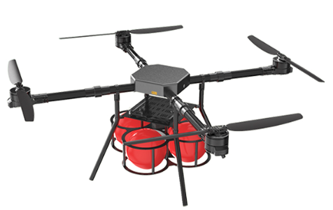
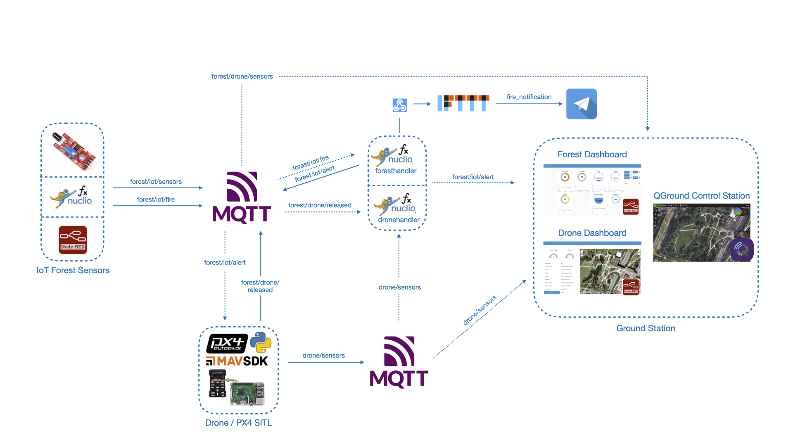
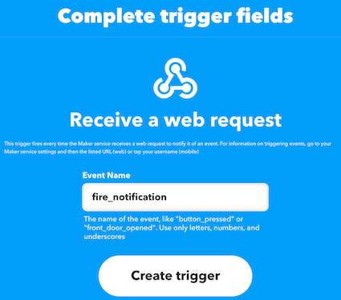
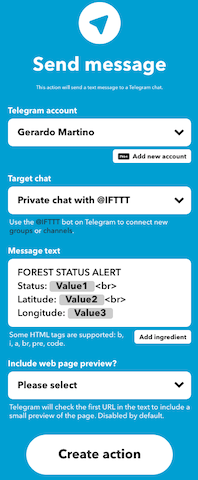

# **Forest-Fire-Detection**: Serverless Computing For IoT Project

<p align="center">

</p>

## Summary

[1. Introduction](#Introduction): Problem introduction and a possible solution\
[2. Architecture](#Architecture): Architecture of the idea\
[3. Project structure](#Project-structure): How the project is organized\
[4. Getting started](#Getting-started): Guide to run the project

## Introduction

This is a project for the exam of **Serverless Computing for IoT**.<br>

Forest fire is one of the world's biggest calamities that produce significant damage to the atmosphere and also the injunction of danger environment. Internet of things and drone technology are fested booming sectors, that evolves rapidly. This advanced technology can prevent such kind of incident and also making fast decision without the intervention of the humans.The proposed service oriented architecture involves a series of communication between devices and distribute in real-time all the data to the Ground Station. The adoption of all this intelligent devices, with communication capability enable a new concept called "Internet of Forest Things".
The proposed methodology implements sensors which are installed on the tree that detects the presents of fire and immediately sents the right coordinate to the Unmanned Air Vehicles (UAVs). The UAV immediately takeoff and fly over the forest, reached the fire spot, the UAV releases the fire balls extinguisher and than return to the home base and land.

## Architecture



From the architecture, in the block "Iot Forest Sensors" we have three types of sending fire alarm, on the top we have the HW prototype made with an ESP32 microcontroller properly connected to a flame detector sensor, led/buzeer and an LCD screen. Initially to speed up development, the flame alarm was simulated by two different nodes, one through a 'sendfirealarm' function created through the Nuclio Framework and the other through the Node-RED framework. Both simulated and real sensors use the mqtt protocol to publish their status.
When the sensor detects a flame sends a notification in the RabbitMQ queue 'forest/iot/fire', the 'foresthandler' function through a trigger reads all messages sent on the previous topic and when the flame alert condition occurs, the function publish an alert message on the topic 'forest/iot/alert', then two events arise:

1. HTTP request to IFTTT Webhook, configured to to send an alert messages and flame coordinates to a telegram bot.
2. Activation of the alert status in the Forest Dashboard, publish the flame coordinates to the connected UAV unit that is subscribed to the topic.

The unit received the coordinates, initializes the flight parameters, loads the flight mission, arms the engines and start the mission. The unit in flight continues to publish on the topic 'drone/ sensor' the parameters necessary for geolocation and also the status of the drone.

The drone reached the fire spot drops the fire ball extinguisher and publish on the topic 'forest/drone/released' the actual release, then sets his status to return to launch position, at the same time the nuclio function dronehandler is triggered, so a new messase is sent to update the flame status alarm.

## Project Structure

1. Function

- **foresthandler.js**: Nuclio function that is executed when a fire is detected;
- **dronehandler.js**: Nuclio function that is executed when the drone released the fire ball extinguisher;
- **sendfirealarm.js**: Nuclio function to simulare a fire alarm;
- **.yaml** functions\*: function exported from Nuclio framework with all the deploying informations.

2. Sensor

- **IoTForestSensor.ino**: Sketch for the ESP32 MCU, used as flame detector.

3. Node-RED

- **flow.json**: Node-RED exported flow, in detail:
  - Forest IoT Sensors: flow used for the simulation of the different sensors usefull for fire detection;
  - Forest Dashboard: flow used to visualize the data stream from the forest sensors (with optional button for sensor simulation);
  - Drone Dashboard: flow used to visualize the status and the paramenter of the UAV.

4. Drone

- **mqtt_drone.py**: file containing all the function used by the drone to pub/sub and run specific corridor mission;
- **mqtt_config.json**: contains the parameters to configure the drone as mqtt client.

## Getting Started

---

### Important Notes

Install Node.js using the installer [Download](https://nodejs.org/en/download/)
Install Docker following Docker installation guide [Get Docker](https://docs.docker.com/get-docker/).

- In order to execute the drone python script you need Python 3.7+: run python --version or python3 --version in a terminal to check the installed version
- If not installed use the following link: [Python](https://www.python.org/).
- Install pip3 package manager or run pip3 instead of pip and python3 instead of python, depending of your system defaults
- Install [git](https://git-scm.com/downloads) ->
- Install [MAVSDK](https://github.com/mavlink/MAVSDK-Python)
- Install [aioconsole](https://aioconsole.readthedocs.io/en/latest/)
- Install [aysncio-mqtt](https://github.com/sbtinstruments/asyncio-mqtt)

---

### IFTTT

Register on [IFTTT](https://ifttt.com) and [create a new applet](https://ifttt.com/create) by adding on IF clause WebHooks service > Receive a web request with the following parameter:



and with a THEN clause Telegram > Send Message with the following parameters:



Once done, by going into My Applets > "Fire Notification Applets" > WebHook icon > Documentation > Copy the **ifttt_event_key**. That key need to be saved and used in the [Nuclio Forest function](Function/foresthandler.js) and [Nuclio Drone function](Function/dronehandler.js)

---

### Nuclio

Start [Nuclio](https://github.com/nuclio/nuclio) using a docker container.

```sh
$ docker run -p 8070:8070 -v /var/run/docker.sock:/var/run/docker.sock -v /tmp:/tmp nuclio/dashboard:stable-amd64
```

Browse to http://localhost:8070.

**Update and deploy Functions**:

- Type '**localhost:8070**' on your browser to open the homepage of Nuclio
- Create new project and call it 'Forest Fire Detection';
- Press '**Create function**', '**Import**' and upload the **.yaml** function that are in the **Function** folder;
- Change the **IP, PORT, USER and PASSWORD** according with your MQTT broker also update the **ifttt_event_key** generated from IFTTT;
- On '**Trigger**' tab also change the '**IP, PORT, USER and PASSWORD**' according with your MQTT Broker;
- Press 'Deploy'.

---

### RabbitMQ

Start [RabbitMQ](https://www.rabbitmq.com) instance with MQTT enabled using docker.

```sh
$ docker run -p 9000:15672  -p 1883:1883 -p 5672:5672  cyrilix/rabbitmq-mqtt
```

Browse to http://localhost:9000. The default username is **_guest_**, and the password is **_guest_**

---

### PX4 SITL (Software In The Loop)

Start [PX4 SITL](https://github.com/JonasVautherin/px4-gazebo-headless) instance using docker.

```sh
$ docker run --rm -it jonasvautherin/px4-gazebo-headless:1.13.0
```

---

### MAVSDK Python

Is a Python wrapper for MAVSDK. MAVSDK is a set of libraries providing a high-level API to MAVLink. It allow to write programs and to control a MAVLink-enabled drone.

### Parameters

In order to execute Python script ([mqtt_drone.py](Drone/mqtt_drone.py)) you need to set the following parameters on ([mqtt_config.json](Drone/mqtt_config.json)):

- **IP**: address of the broker;
- **PORT**: port of the broker;
- **USERNAME**: user used for the authentication;
- **PASSWORD**: psw used for the authentication.

Once done execute the script:

```sh
$ python3 mqtt_drone.py
```

---

### Node-RED

Start [Node-RED](https://nodered.org/docs/getting-started/docker) instance using docker.

```sh
$ docker run -it -p 1880:1880 -v node_red_data:/data --name mynodered nodered/node-red
```

Browse to http://localhost:8070.

**Installation and Configuration**:

- Type '**localhost:1880/**' on your browser to open the homepage of Node-RED;
- '**Import**' the ([flow.json])(Node-RED/flow.json);
- Press '**Manage palette**' and from the tab '**Install**' search for the following palette:
  - node-red-dashboard;
  - node-red-contrib-web-worldmap;
  - node-red-contrib-ui-led;
  - node-red-contrib-mqtt-broker;
- Press on one of the **mqtt nodes**, edit **mqtt-broker node** and change according with your MQTT Broker, **SERVER and PORT** in '**Connection**" and **USER and PASSWORD** in '**Security**';
- On '**Trigger**' tab also change the '**IP, PORT, USER and PASSWORD**' according with your MQTT Broker;
- Press 'Deploy'.

---

### Forest IoT Sensor


Connect all the components according with [ESP32_Connections.fzz])(IoT_Forest_Sensor/ESP32_Connections.fzz);

**Installation and Configuration**:

- Open '**Arduino IDE**' and '**Open**' [IoTForestSensor.ino])(IoT_Forest_Sensor/IoTForestSensor.ino);
- Configure **MQTT_server** and **MQTT_PORT** according with your MQTT Broker and set **SSID** and **PASSWORD**;
- Press and select the right board: **Tools > Board > ESP32 Arduino > DOIT ESP32 DEVKIT V1**
- Uodate the **Upload Speed** to 115200 and **Port** with the correct one;
- '**Verify**' and '**Upload**' the Sketch on the ESP32 MCU board.
- Open the Serial monitor and check if connected.
